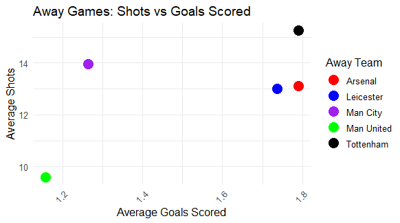
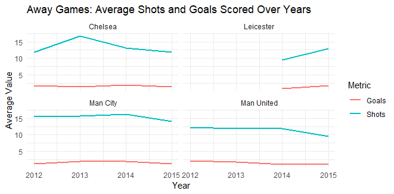
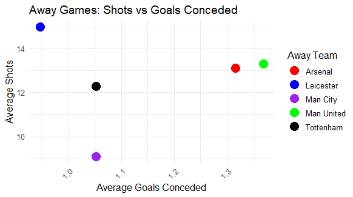
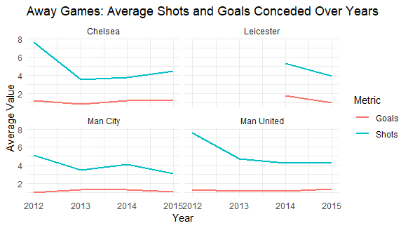
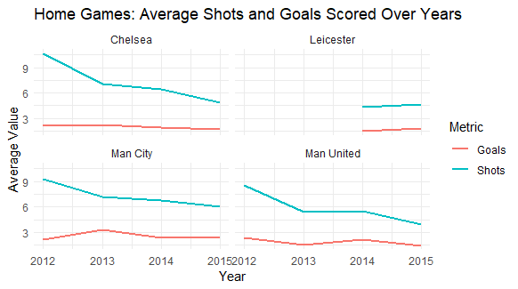
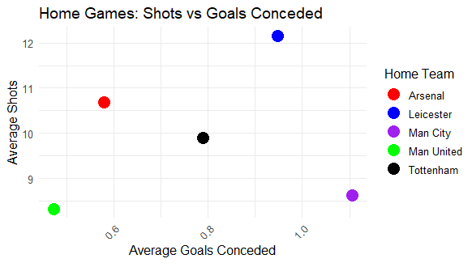
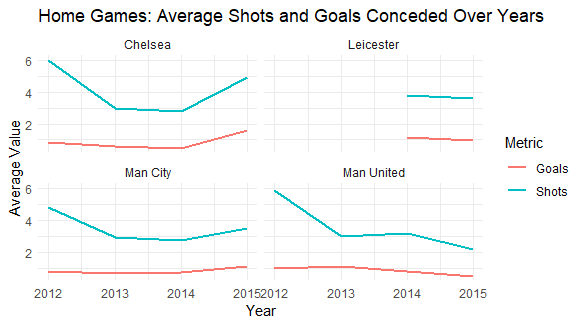

# ⚽ The Peculiar Case of Leicester City FC: Achieving the Unthinkable

In one of the greatest sporting upsets of all time, **Leicester City FC** went from relegation candidates to **Premier League champions** in 2015–16, starting the season as **5000-to-1 underdogs**.

This project explores **how** that happened — using data from previous Premier League seasons to identify **performance patterns, tactical edges, and statistical anomalies** that contributed to their remarkable triumph.

---

## 🧠 Core Questions

- What was Leicester City doing differently in 2015–16?
- How did their home and away performances compare to other top clubs?
- Were their results an outlier — or an evolution in progress?

---

## 🛠 Tools & Techniques

- **R / Quarto**
- **Data wrangling & aggregation** (`dplyr`)
- **Advanced visualizations** (`ggplot2`)
- Public data from [Kaggle](https://www.kaggle.com/datasets/saife245/english-premier-league)

---

## 📊 What I Did

- Aggregated home and away performance stats from 2012–2016
- Compared Leicester with top clubs (Man City, Man United, Arsenal, Chelsea, Spurs)
- Visualized trends in:
  - Goals scored vs conceded
  - Shots attempted vs allowed
  - Goal differentials
- Identified unique patterns in **tight win margins**, **defensive efficiency**, and **conversion rates**

---

## 🧠 Key Findings

| Theme | Insight |
|-------|---------|
| 🛡️ Defense | Leicester conceded the **fewest goals away from home** despite allowing many shots |
| 🎯 Attack | At home, they were **highly efficient** with very few chances — high conversion rate |
| 📈 Margins | Most wins came with **low goal margins**, suggesting tactical discipline and risk aversion |
| 🔄 Comparison | Top clubs showed **inconsistent attacking evolution** across the same seasons |

---

## 📸 Visual Highlights

<p float="left">
  
  
  
  
</p>

<p float="left">
  
  
  
  
</p>

---

<## 📁 Folder Structure 
``` 
leicester-city-analysis/ 
├── leicester_eda.qmd # Full analysis in R Markdown 
├── leicester_eda.html # Rendered report with graphs 
├── datasets/ # Historical EPL match data 
├── readme.md # This file! 
├── leicester_wrangling.pdf # Final presentation slides 
├── screenshots/ # Visualizations (screenshots) 
```

---

## 📷 Preview

📄 [View the full report (HTML)](leicester_eda.html)  
📊 [View final presentation (PDF)](leicester_wrangling.pdf)

---

## 🔍 Future Extensions

- Add player-level stats (e.g., Vardy, Mahrez) for individual contribution analysis
- Build a predictive model for match outcomes using these features
- Investigate role of manager tactics and substitutions

---

## 👨‍💻 Author

**Asad Adnan**  
Master's in Business Analytics, University of Notre Dame  
*Exploring data-driven storytelling in sports, strategy, and behavior.*

